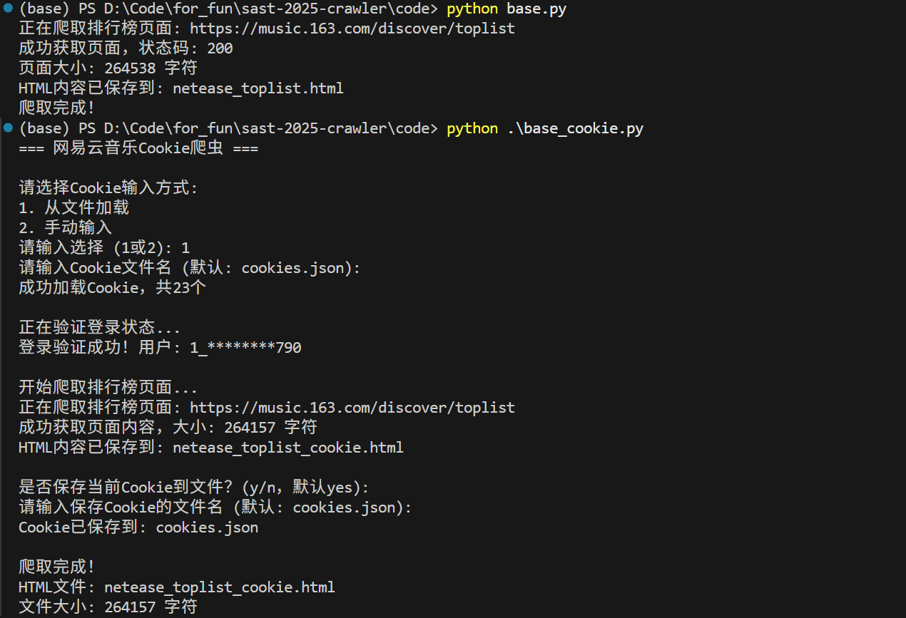
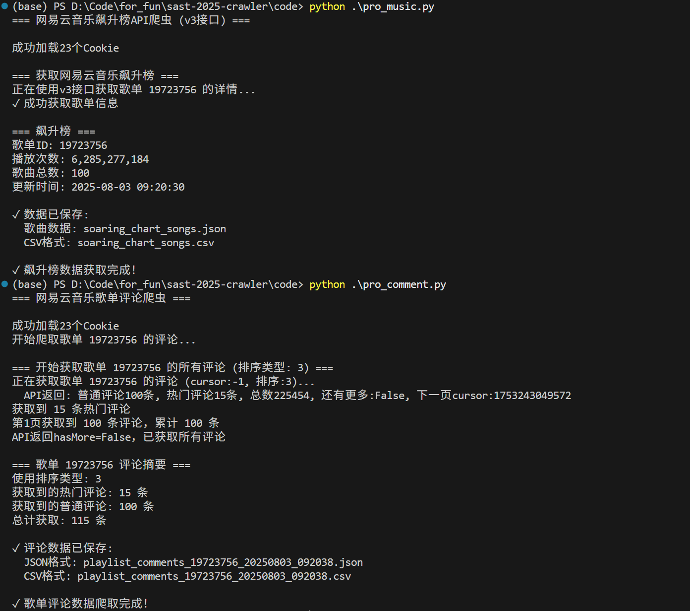

## 关于运行环境

所有code中的代码的依赖都很少，如果遇到 module 缺失的问题，直接按照提示 pip install 即可

## 代码运行示例

## 补充

- 近期看到一个github仓库，和爬虫有关，有兴趣的同学可以看看：[Douyin_TikTok_Download_API](https://github.com/Evil0ctal/Douyin_TikTok_Download_API)
