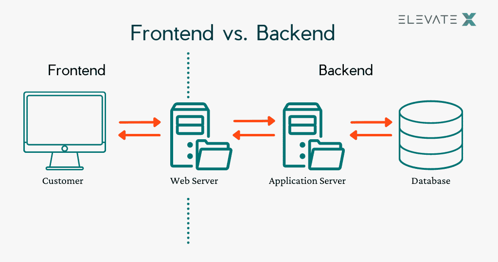
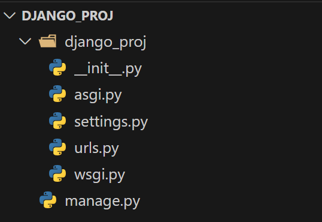

# 课程讲义：Django

## 从前后端分离说起

一种简单的理解：

- 前端负责展示数据，与用户交互
- 后端负责处理数据，与数据库交互



图源：[elevatex.de](https://elevatex.de/blog/it-insights/frontend-vs-backend-vs-fullstack-differences/)

### 核心概念：API

API（Application Programming Interface，应用程序编程接口）是一组用于构建和集成应用程序的预定义规则和协议。API允许不同的软件应用程序相互通信和共享数据。

在前端-后端架构中，API是前端和后端之间的桥梁。前端通过API请求后端的数据，后端通过API返回数据给前端。其优势在于：独立部署、可维护性、安全性。常用的API包括RESTful API、GraphQL等。

### 常用框架

- 后端：

  - Django、Flask（Python）
  - Spring Boot（Java）
  - Laravel（PHP）
- 前端：

  - React
  - Vue.js
  - Angular
- 通信：

  - RESTful API
  - WebSocket
  - gRPC
    ......

## 什么是Django?

> Django was invented to meet fast-moving newsroom deadlines, while satisfying the tough requirements of experienced web developers. (from [official website](https://www.djangoproject.com/))

Django是一个开源高效的Python Web框架，它鼓励快速开发和干净、实用的设计，其主要目标是使得开发复杂的、数据库驱动的网站变得简单，它遵循MVC设计模式。

### Try it out: 框架里有些什么?

```bash
django-admin startproject proj
cd proj
python manage.py runserver
```



- wsgi.py 是 同步 的入口，用于传统的 HTTP 请求处理。
- asgi.py 是 异步 的入口，支持 WebSocket 和高并发场景。
- Django 同时支持这两种协议，你可以根据项目需求选择合适的部署方式。
- manage.py 是 Django 的命令行工具，用于管理项目。

与项目主目录平齐，每个应用被存储在一个独立的目录中，每个应用都有自己独立的模型、视图、模板等，是既独立又可交互的模块。

如果要创建一个应用/启动服务，可以使用以下命令：

```bash
python manage.py startapp appname
python manage.py runserver
```

### 核心概念：MTV架构与MVC模式

MTV (Model-Template-View) 架构：

- Template：模板，与 MVC 中的 View 非常相似。它负责决定数据如何展示，是表现层。
- View：视图，与 MVC 中的 Controller 非常相似。它负责处理用户请求，是逻辑层。
- MTV 的数据流：用户请求 -> View -> Model -> View -> Template -> 用户响应

MVC（Model-View-Controller）是一种设计模式，用于将应用程序分为三个主要部分：模型、视图和控制器。这种架构强制性地将业务逻辑、数据处理和页面展示分离开来，使得代码结构清晰、职责分明——“高内聚，低耦合”。

- Model：模型，负责定义数据结构、与数据库交互，处理数据
- View：视图，负责处理用户请求，返回数据
- Controller：控制器，负责路由，将请求转发给相应的视图

接下来我们将以**在线博客平台**为实际案例，探讨利用Django进行后端开发的机制与实践。

## Model 与 ORM

### ORM及其核心原理

ORM（Object-Relational Mapping，对象关系映射）是在面向对象的编程语言（如Python）与关系型数据库（如MySQL、PostgreSQL）间建立映射关系。借助这一实现，我们能够使用面向对象的语法去操作数据库，而无需直接编写SQL语句。

Django的ORM系统支持多种数据库，从而屏蔽不同数据库的语法差异（如MySQL与PostgreSQL的SQL语法区别）；同时，统一数据模型定义与业务逻辑，减少冗余代码。

我们要怎样使用？——“**定义-映射-操作**”

1. **定义模型**：在 `models.py`中通过继承 `models.Model`类，构建自定义数据模型；
2. **生成映射**：通过“迁移（migrations）”机制，将模型类自动转换为数据库表结构；
3. **操作数据**：通过模型类/实例的方法（如 `save()`、`filter()`）执行增删改查操作，ORM自动将其转换为对应SQL并执行。

本质而言：用更对象化、同一化的python语法，达成与数据库交互的各项功能。

### 模型的定义

- `models.Model`：所有模型类的基类，提供了操作数据库的方法。
- Model(Python 类) -- 数据库表
- Attribute(属性) -- 字段
- Instance(实例) -- 数据库表中的一行记录

所有Model类必须继承 `django.db.models.Model`，并定义字段（属性）。字段对应数据库表中的列，每个字段都是一个 `Field`类的实例，用于指定字段的类型、约束等。一个blog应用的文章模型（Article）示例如下：

```python
from django.db import models

class Article(models.Model):
    # 标题：字符串类型，最大长度100，不允许为空
    title = models.CharField(max_length=100, verbose_name="文章标题")
    # 内容：文本类型（无长度限制）
    content = models.TextField(verbose_name="文章内容")
    # 发布时间：日期时间类型，自动设置为创建时的时间
    publish_time = models.DateTimeField(auto_now_add=True, verbose_name="发布时间")
    # 阅读量：整数类型，默认0
    read_count = models.IntegerField(default=0, verbose_name="阅读量")

    def __str__(self):
        return self.title

    class Meta:
        # 模型元数据（非字段信息）
        db_table = "article"  # 自定义表名（默认表名为“app名_类名小写”，如blog_article）
        ordering = ["-publish_time"]  # 默认排序：按发布时间降序（最新的在前）
        verbose_name = "文章"  # 单数显示名
        verbose_name_plural = "文章列表"  # 复数显示名
```

#### 核心字段类型与参数

Django提供了丰富的字段类型，对应数据库中的不同列类型，常用类型如下：

| 字段类型                        | 说明                                     | 常用参数                                                           |
| ------------------------------- | ---------------------------------------- | ------------------------------------------------------------------ |
| `CharField`                   | 短文本（如标题、姓名）                   | `max_length`（必传，最大长度）                                   |
| `TextField`                   | 长文本（如文章内容、备注）               | -                                                                  |
| `IntegerField`                | 整数（如阅读量、数量）                   | `default`（默认值）                                              |
| `FloatField`/`DecimalField` | 浮点数（如价格，`DecimalField`更精确） | `max_digits`（总位数）、`decimal_places`（小数位）             |
| `DateTimeField`               | 日期时间（如发布时间）                   | `auto_now_add`（创建时自动记录）、`auto_now`（更新时自动刷新） |
| `DateField`                   | 日期（如生日）                           | -                                                                  |
| `BooleanField`                | 布尔值（如是否置顶）                     | `default=False`                                                  |
| `ForeignKey`                  | 外键（一对多关系）                       | `to`（关联模型）、`on_delete`（级联删除策略）                  |
| `ManyToManyField`             | 多对多关系（如文章与标签）               | `to`（关联模型）                                                 |
| `OneToOneField`               | 一对一关系（如用户与个人资料）           | `to`、`on_delete`                                              |

**常用字段参数**（适用于大部分字段）：

- `null=True`：数据库中允许为NULL（默认 `False`）；
- `blank=True`：表单验证时允许为空（默认 `False`，与 `null`的区别：`blank`针对表单，`null`针对数据库）；
- `unique=True`：字段值唯一（如用户名）；
- `verbose_name`：字段的显示名称（Admin后台用）；
- `choices`：限定可选值（如状态字段）：
  ```python
  STATUS_CHOICES = [
      ("draft", "草稿"),
      ("published", "已发布"),
  ]
  status = models.CharField(max_length=20, choices=STATUS_CHOICES, default="draft")
  ```

#### 模型元数据（Meta类）

`Meta`类用于定义模型的非字段属性，常用配置：

- `db_table`：指定模型对应的数据库表名
- `ordering`：指定模型的默认排序字段
- `indexes`：定义模型的数据库索引
- `verbose_name`：模型的单数可读名称
- `verbose_name_plural`：模型的复数可读名称

#### 关联与关系

在Django中，关联与关系是指模型之间的引用关系，如外键（`ForeignKey`）、多对多（`ManyToManyField`）等。

```python
# 定义作者模型
class Author(models.Model):
    name = models.CharField(max_length=50, verbose_name="姓名")
    # ...
# 文章模型关联作者（外键）
class Article(models.Model):
    # ...
    author = models.ForeignKey(
        to=Author,  # 关联的模型
        on_delete=models.CASCADE,  # 级联删除
        related_name="articles"  # 反向查询的属性名（作者.articles可查其所有文章）
    )
```

类似地，多对多关系指的是一个模型实例可以关联多个其他模型实例，且多个实例之间也可以互相关联，如文章与标签的关系，定义方式如下：

```python
class Tag(models.Model):
    name = models.CharField(max_length=20, verbose_name="标签名")
    # ...
class Article(models.Model):
    # ...
    tags = models.ManyToManyField(
        to=Tag,  # 关联的模型
        related_name="articles"  # 反向查询的属性名（标签.articles可查其所有文章）
    )
```

### 数据库迁移

```bash
python manage.py makemigrations app_name  # 为指定应用生成迁移文件（无app名则为所有应用）
python manage.py migrate  # 将所有未应用的迁移文件同步到数据库
```

执行后，Django会在 `app/migrations`目录下生成迁移文件（如 `0001_initial.py`），记录模型的变更历史。

### 数据库操作

以下是文章模型的CRUD操作示例：

```python
from .models import Article
article = Article.objects.create(title="Django 基础", content="...")
article_2 = Article(title="新文章", content="...")
article.id  # 自动保存生成的主键值
# article_2.id  # 未保存前无主键值
article_2.save()  # 保存到数据库
article_3 = Article.objects.get(id=1)  # 查询id=1的文章
article_3.title = "新标题"
article_3.save()
article_3.delete() 
all_articles = Article.objects.all()
# 查询阅读量大于200的文章
popular_articles = Article.objects.filter(read_count__gt=200)
# 查询标题包含“Django”的文章（模糊查询）
django_articles = Article.objects.filter(title__icontains="Django")
/django/i
# 按阅读量降序排序
sorted_articles = Article.objects.all().order_by("-read_count")
```


Django 提供了强大的查询功能，支持复杂的查询条件、排序、限制数量、聚合、分组等操作。

#### 自定义管理器（Manager）

默认管理器是 `objects`，可自定义管理器添加常用查询方法：

```python
class UserManager(models.Manager):
    def active_users(self):
        """查询活跃用户（最近30天登录过）"""
        from django.utils import timezone
        return self.filter(last_login__gte=timezone.now()-timezone.timedelta(days=30))

class User(models.Model):
    # ...
    objects = UserManager()  # 替换默认管理器

active_users = User.objects.active_users()
```

> 在实际使用中，设计理念非常重要......需要考虑兼顾性能、可维护性、可扩展性。

## View 视图函数

视图函数负责处理HTTP请求并返回响应。

### 函数视图（Function-Based Views）

在定义函数视图时，通常需要接收一个 `request`参数，这个参数是 `HttpRequest`对象，它封装了客户端发送的HTTP请求的所有信息，包括请求方法（如 GET、POST 等）、请求头、请求参数、用户信息等。函数视图在处理完业务逻辑后，需要返回一个响应对象，这个响应对象可以是渲染后的 HTML 页面、重定向指令、JSON 数据或者其他格式的响应内容，以此来响应用户的请求。

```python
# blog/views.py
fdef article_list(request):
    articles = Article.objects.all().order_by('-publish_time')
    return render(request, "article_list.html", {"articles": articles})

```

```python
def delete_article(request, article_id):
    article = get_object_or_404(Article, id=article_id)
    if request.method == 'POST':
        article.delete()
        return redirect('article_list')
    else:
        return HttpResponseForbidden("Only POST requests allowed")

```

### 类视图（Class-Based Views）

类视图采用面向对象编程的思想，通过继承 Django 提供的各类基础视图类（如 `ListView`、`DetailView`、`CreateView` 等）来构建视图。借助这种继承机制，开发者可以复用基础视图类中的代码和功能，避免重复编写相同的逻辑，从而大幅简化代码量。在处理数据库操作时，类视图能够帮助开发者以更简洁、高效的方式完成开发任务。

```python
from django.views.generic import ListView
from .models import Article

class ArticleListView(ListView):
    model = Article  # 指定模型，自动查询所有数据
    template_name = 'article_list.html' 
    context_object_name = 'articles'  # 模板中使用的变量名（默认是object_list）
    paginate_by = 10 # 分页
```

#### 常用通用类视图：

| 视图类         | 用途             | 核心属性/方法                                  |
| -------------- | ---------------- | ---------------------------------------------- |
| `ListView`   | 展示对象列表     | `model`、`paginate_by`、`get_queryset()` |
| `DetailView` | 展示单个对象详情 | `model`、`get_object()`                    |
| `CreateView` | 创建对象         | `model`、`form_class`、`success_url`     |
| `UpdateView` | 更新对象         | 类似CreateView，需指定对象ID                   |
| `DeleteView` | 删除对象         | `success_url`（删除后跳转）                  |

- 代码复用性强，更少地造轮子
- 内置分页、表单处理等功能
- 结构清晰，符合面向对象设计

### 我们要如何访问视图函数呢？——URL配置

Django的URL配置采用"项目-应用"两级分发机制，便于模块化管理。项目级URL配置在项目根目录下的 `urls.py`中，应用级URL配置在应用目录下的 `urls.py`中。项目根目录下的 `urls.py`负责将URL前缀分发到对应的应用，示例：

```python
from django.contrib import admin
from django.urls import path, include

urlpatterns = [
    path('admin/', admin.site.urls),
    path('', include('blog.urls')),    # 将根路径下的请求分发到blog应用
    path('users/', include('users.urls')), 
]
```

应用内的 `urls.py`定义具体URL与视图的映射关系，也是类似的表达：

```python
from django.urls import path
from . import views

urlpatterns = [
    path('', views.index, name='index'),
    path('articles/', views.article_list, name='article_list'),
    path('articles/<int:article_id>/', views.article_detail, name='article_detail'),
]
```

- `<类型:变量名>`：捕获URL中的动态部分并传递给视图
- 除了 `int`之外，`str`（匹配非空字符串）、`uuid`（匹配UUID）、`slug`（匹配字母、数字、下划线、连字符组成的字符串）、`path`（匹配包含 `/`的完整路径）等类型也常用。
- 可使用 `reverse()`函数进行反向解析，以此根据 URL 名称和参数生成实际 URL。
- 在html模板中，可使用 ``标签进行URL反向解析。
- namespace：为URL模式添加命名空间，避免不同应用之间的URL名称冲突。

```python
    url = reverse('article_detail', args=[1])  # 结果：/article/1/
    url = reverse('article_detail', kwargs={'article_id': 1})
```

```html
<a href="">查看文章</a>
<a href="">发布文章</a>
```

### 装饰器

```python
from django.contrib.auth.decorators import login_required, permission_required, method_decorator
from django.views.decorators.cache import cache_page

# 要求登录
@login_required
def article_create(request):
    pass

# 缓存视图结果（5分钟）
@cache_page(60 * 5)
def article_list(request):
    pass

@method_decorator(login_required, name='dispatch')
class ArticleCreateView(CreateView):
    pass
```

> 在实际项目中，安全性是一个重要的考虑因素。确保所有用户输入都经过验证，防止SQL注入、XSS攻击等安全问题，同时对敏感数据进行加密存储、对用户权限进行严格控制，避免未授权访问。

## Django Admin 管理

Django Admin 提供强大的可自定义的后台管理功能，无需编写代码即可管理数据库中的数据。

### 注册模型

在确保admin已在设置中启用后，需在 `admin.py`中注册模型：

```python
from django.contrib import admin
from .models import Article, Tag, Comment

admin.site.register(Article)
admin.site.register(Tag)
admin.site.register(Comment)
```

### 设置超级用户

1. 创建超级用户：
   ```bash
   python manage.py createsuperuser
   ```
2. 输入用户名、邮箱、密码（确认密码）
3. 登录Admin后台：`http://localhost:8000/admin/`

## Test 测试

Django 提供了强大的测试框架，用于编写和运行测试用例，确保代码的正确性和稳定性。在编写了对应的测试用例后，可以使用 `python manage.py test` 命令来运行测试。若需要运行特定应用的测试，可以使用 `python manage.py test app_name` 命令。

### 测试原则与思想

1. **测试隔离**: 每个测试都应该是独立的，不依赖其他测试
2. **使用setUp和tearDown**: 正确设置和清理测试环境
3. **描述性测试名称**: 测试方法名应该清楚描述测试内容
4. **测试边界条件**: 测试正常情况和异常情况
5. **保持测试简单**: 每个测试只验证一个功能点
6. **使用适当的断言**: 选择最合适的断言方法
7. **测试覆盖率**: 使用coverage工具检查测试覆盖率

## 演示代码

- 查阅演示代码请[点此访问](https://github.com/sast-summer-training-2025/django-demo)
- 对Django框架感兴趣的同学可以尝试将接口统一为向前端返回数据与信息的模式，也可以尝试编写一些测试用例~

## 参考资料

- [Django官方文档](https://docs.djangoproject.com/en/5.2/)
- [维基百科](https://zh.wikipedia.org/wiki/Django)
- [酒井科协 &amp; 算协联合暑培 2024 - Django](https://summer23.net9.org/backend/django/django/)
- 注：本文档及演示代码中包含了部分AI生成内容及个人理解，如有错误或不当之处请指正。
