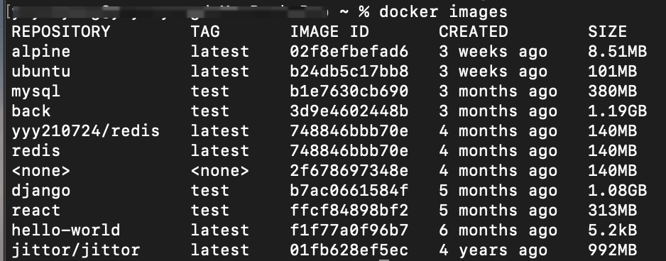
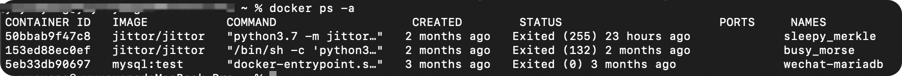
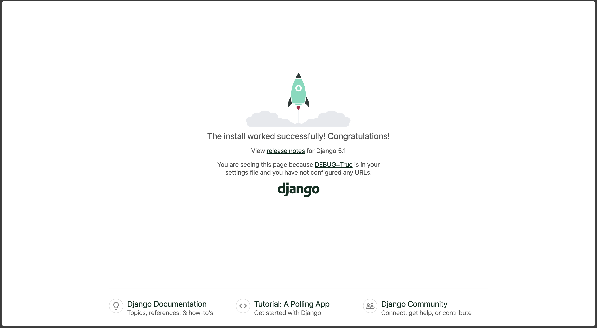
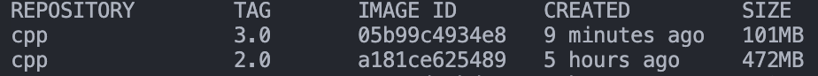
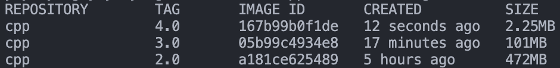
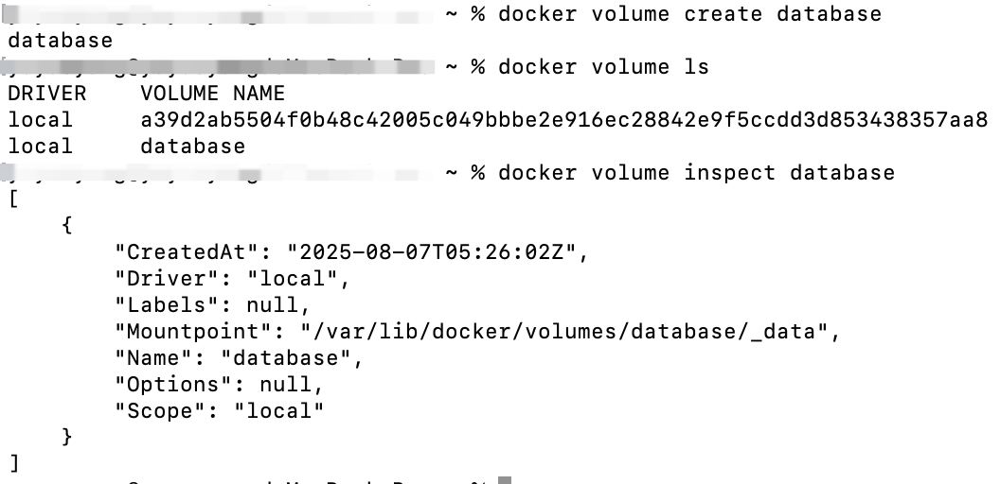

# Docker 课程讲义

## Docker 是什么

以下是Docker官方文档中对于Docker的介绍：

> Docker is an open platform for developing, shipping, and running applications. Docker enables you to separate your applications from your infrastructure so you can deliver software quickly. With Docker, you can manage your infrastructure in the same ways you manage your applications. By taking advantage of Docker's methodologies for shipping, testing, and deploying code, you can significantly reduce the delay between writing code and running it in production.

总结下来，Docker其实就是一个基于虚拟化技术的、用于“打包”和“承载”应用程序运行环境的工具。

现在看起来可能还一头雾水，不如让我们先来看看为什么要使用Docker。

## 为什么要使用 Docker

相信每一位程序员都经历过（甚至大部分时间都在经历）配环境的**痛苦**。在开发的过程中，我们会频频遇到以下问题：

- 依赖项冲突；
- 所运行的程序可能会修改一些不希望被修改的本机系统文件，甚至对系统有害；
- 软件开发过程中项目的频繁部署；
- 无法复现其他人的运行环境，如「[您配吗](https://github.com/RimoChan/match-you)」中提到的情况。

如果你即将/已经成为一名程序员，相信你已经或多或少感受过以上令人头大的场景，于是聪明的你想到：既然我们已经可以把**执行任务的代码**打包成**应用程序**，实现点击即用，那为什么不能把**程序的运行环境**也打包成某种东西（镜像），并通过某一载体（容器）来承载，从而也实现点击即用呢？

你可能听说过一种名为虚拟机的技术~~没听过也没关系~~，这是一种典型的虚拟化技术，它可以在同一台物理机上，模拟出多个虚拟机，它们各自拥有自己的计算资源和操作系统，相互之间可以隔离开来。应用程序（连带其运行环境）会运行在某一虚拟机内部，不会对其他虚拟机产生影响。并且，只要将运行该应用程序的虚拟机打包，其他人获得副本后，就可以直接运行相应的程序。

听起来很好，很符合我们的需求，对吧？但是如果你真的接触过一些虚拟机产品，就会知道，虚拟机往往体积十分庞大（毕竟包含一整个操作系统），占用的计算机资源较多，运行速度慢，性能也并不理想。若为每个应用程序都配置一个虚拟机，将会面临巨大的硬件成本，这显然是不可行的。

再仔细想想，仅仅为了运行一个特定的应用程序，我们真的需要一套独立的计算资源和操作系统吗？肯定不是的。其实，应用程序只关心自己所处的软件环境中是否含有所需的所有依赖，至于这一软件环境处于何种操作系统内、操作系统如何调用计算资源，与应用程序并无直接关系。所以，我们只需要为每个应用程序都提供一个虚拟化的软件环境就可以了，即便它们运行在同一个操作系统上，又使用同一套计算资源。

我们所要介绍的Docker，就是这样的一个**轻量级**虚拟化技术。它将应用程序运行在**容器**（**Container**）中，容器直接运行在主机内核上，使用主机资源，并与外界（操作系统、其他容器）隔离，提供我们所需要的服务。

Docker具有以下优势：

- 隔离与安全性：Docker容器与外界隔离，（在正确配置下）基本不会干扰外界环境，保护系统和应用的安全性；
- 环境一致性：容器可以确保不同的合作开发者拥有完全相同的运行环境，避免出现「[您配吗](https://github.com/RimoChan/match-you)」的问题。
- 轻量化：容器无需独立的操作系统，占用的硬件资源较虚拟机少了很多，大量容器同时运行时仍能保证一定的性能。

## 基本概念

### 镜像（Image）

我们所使用的操作系统，往往分为**内核**和**用户空间**。Linux内核启动后，会自动挂载 root 文件系统`/`，以提供用户空间的支持。而 Docker 镜像就相当于一个 root 文件系统，只是包含了应用程序运行所需的所有东西。

《Docker 从入门到实践》中给出的对于镜像的定义：

> **Docker 镜像**是一个特殊的文件系统，除了提供容器运行时所需的程序、库、资源、配置等文件外，还包含了一些为运行时准备的一些配置参数（如匿名卷、环境变量、用户等）。镜像**不包含**任何动态数据，其内容在构建之后也不会被改变。

镜像还有一个特性，就是**分层存储**。其使用 UnionFS（联合文件系统）技术，将不同文件系统联合挂载到同一个目录下。所以镜像只是一个虚拟的概念（而不是像 `ISO` 一样的一个打包文件），它实际上并不是一个文件，而是一组文件系统的组合。同理，镜像构建也是一层一层完成的，每一层构建完就不再发生改变，后一层上的**任何改变**（包括增加文件、**删除**文件等）都只发生在自己这一层。

以上内容可能还是有些抽象，现在不理解也没关系，后面介绍镜像构建时还会深入解释。

### 容器（Container）

要解释**镜像和容器**之间的关系，我们可以类比面向对象中**类与实例**的关系：**镜像**就像一个**类**，规定了运行应用程序所需的资源、配置等；而**容器**就像一个**实例**，可以被创建和销毁等。在面向对象中，**类是静态的**，其定义不会被**实例**所修改，同理，**镜像也是静态的**，在**容器**中对环境进行修改（如增加依赖、修改环境变量等），并不会修改**镜像**的内容。

容器本质上是进程，但它（们）运行于独属于容器自己的**命名空间**。因此容器可以拥有自己的文件系统、网络配置、进程空间、用户ID空间等，与宿主机中的其他进程隔离，就像自己在一个独立于宿主机的系统上操作一样。这种隔离带来了安全性的提升。

前面提到镜像是分层的，同样，容器也是分层的。容器运行时，以镜像为基础层，在其上构建一个自己的**容器存储层**（可读可写），应用程序在镜像基础层和容器存储层叠加而成的文件系统中运行。

不难想到，容器存储层的生命周期与容器是一致的。也就是说，当容器消亡时，容器存储层也会消亡，其中的数据随之消失。因此我们说**容器是易失的**（不能持久化存储数据）。要想持久化存储数据，可以使用**数据卷**或**绑定宿主目录**。

### 仓库

镜像构建完成后，可以方便地在宿主机上运行，但如果我们想在其他主机上运行镜像，那么就需要**存储和分发**，Docker Registry就提供了这样的服务。

**注册服务**（Registry）将大量镜像分成多个多个**仓库**（Repository），每个仓库包含多个**标签**（Tag），每个标签对应一个**镜像**（Image）。

假如我们需要一个Ubuntu镜像，已知其仓库的名字为 `ubuntu`，其中包含的标签有 `22.04`，`24.04` 等，表示不同的版本，那么我们可以使用 `ubuntu:24.04` 表示需要 `24.04` 版本的 `ubuntu` 镜像。如果未指定标签，比如使用 `ubuntu` 表示所需镜像，那么将会被默认为 `ubuntu:latest`，即最新版本的镜像。

Docker Registry支持多用户环境，完整的仓库名多为 `用户名/软件名` 的形式，如 `yyy/ubuntu:22.04` 表示用户 `yyy` 的Docker Hub仓库中的镜像 `ubuntu`，版本为 `22.04`。若不包含用户名，则默认指向官方镜像仓库。

## 基本命令

### `docker run`

用于从一个镜像创建一个容器并运行它，用法为：

```shell
docker run <options> <image> <command>
```

其中，`<options>` 是 `docker run` 命令可用的选项，`<image>` 表示创建容器使用的镜像，`<command>` 是创建容器后执行的命令。

一个典型例子为

```shell
docker run alpine:latest echo "hello world!"
```

这表示从镜像 `alpine:latest` 创建一个容器，并在创建后在终端中打印 `hello world!`。

可是，真的就这么简单吗？你一定会奇怪，创建容器使用的镜像是哪来的？执行完命令容器又去哪了？好像还有一系列的问题没有解决。

实际上，这条看似简单的命令，其实做了很多事情：

1. 首先在本地搜索镜像 `alpine:latest`，若找到则直接使用，否则在注册服务（默认为Docker Hub，即官方源，所谓的换源换的也就是这个）搜索，并下载到本地；
2. 使用准备好的 `alpine:latest` 镜像创建一个新的容器并启动；
3. 在容器中运行我们提供的命令 `echo "hello world!"`，若没有提供 `<command>`，则运行镜像设置的默认命令；
4. 执行命令后**终止**容器（注意不是**删除**容器！）。

此时我们便得到了一个用所需镜像创建的、处在停止状态的容器。

`docker run`命令常用的选项有：

- `-d/--detach`，在后台运行容器并显示容器ID；
- `-e/--env <variable>=<value>`，设定环境变量；
- `--rm`，在容器运行完后删除容器；
- `--name <name>`，为创建的容器命名；
- `-p/--publish <host_port>:<container_port>`，将容器中的端口映射到宿主机上；
- `-it`，也即`-i/--interactive -t/--tty`，使用交互模式（开启标准输入）并分配伪终端（可执行exit退出）；
- ...

一种常见的使用 Docker 的方式为

```shell
docker run --rm -it ubuntu
```

表示从镜像 `ubuntu` 创建一个容器，并开启交互模式，分配伪终端，且在容器运行结束后删除该容器。这一命令可以用于在其他系统上临时模拟一个Ubuntu环境，用于测试命令、代码等。

### `docker build`

用于镜像的构建。

常用选项：

- `-f/--file`，用于指定构建使用的 Dockerfile；
- `-t/--tag`，为镜像命名并（可选地）添加标签；
- ...

一种常见的使用方式为

```shell
docker build -f path/to/Dockerfile -t test:1.0 .
```

表示使用路径 `path/to/Dockerfile` 所对应的 Dockerfile 构建一个名为 `test`，标签为 `1.0` 的镜像。

你可能还不知道 Dockerfile 是什么，别着急，下面的章节中会介绍。

注意到命令最后有一个 `.`，请先保持好奇，下面的章节中也会介绍。

### `docker images`

列出当前已有的镜像。



### `docker ps`

列出正在运行的容器。

常用选项：

- `-a/--all`，列出所有容器；
- ...



### 其他常用命令

- `docker exec <options> <container> <command>`，在一个正在运行的容器中执行命令；
- `docker attach <options> <container>`，连接到后台运行的容器，按下`CTRL+P CTRL+Q`可以断开连接；
- `docker start <options> <containers>`，启动一个或多个已停止运行的容器；
- `docker stop <options> <containers>`，停止一个或多个正在运行的容器；
- `docker rm <options> <containers>`，删除一个或多个容器；
- `docker rmi <options> <images>`，删除一个或多个镜像；
- `docker cp <options> <container>:<src_path> <dest_path>`或`docker cp <options> <src_path> <container>:<dest_path>`，在宿主机和容器间复制文件/文件夹；
- ...

## 用 Dockerfile 定制镜像

上面学习了如何使用现存的镜像创建容器，相信你一定会好奇，如果有一些特殊需求，是否可以定制自己的镜像呢？当然，Dockerfile 就是为定制镜像而生的。

### 需求

回忆配置环境的过程，假设我们手中只有一个全新安装、不含 g++ 的 Ubuntu 系统，那么，以运行一个简单的 C++ 语言程序为例，我们需要如下几个步骤：

1. 更新软件包列表，执行 `apt update`；
2. 安装 C/C++ 语言编译所需的工具，执行 `apt install build-essential`；
3. 创建一个 `cpp` 文件，写入一段简单的 C++ 代码，或使用现有的代码文件；
4. 使用 g++ 编译代码，产生可执行文件；
5. 运行可执行文件。

看起来很麻烦，对吧？如果每次有一个新的 C++ 项目，都要从干净的 Ubuntu 镜像出发配置环境，显然是十分耗费精力的，并且也无法发挥 Docker 的优势。此时我们就需要**定制**一个镜像了，我们希望这个定制的镜像能够包含 C++ 运行环境，用其创建的容器能够直接用来编译运行 C++ 代码，这时就需要使用 Dockerfile 了。

### 基本语法

Dockerfile 是一种脚本文件，语法并不困难。我们先来介绍一些常用的命令。

#### `FROM <image>`

用于指定基础镜像，我们的定制镜像就在基础镜像之上构建，比如：

```dockerfile
FROM ubuntu:22.04
```

表示使用版本为 `22.04` 的 `ubuntu` 镜像来定制我们的镜像。

#### `RUN <command>`

用于执行命令，是 Dockerfile 中最常用的指令之一，用法也十分简单，比如：

```dockerfile
RUN echo -e "hello world!" > test.txt
```

表示向文件 `test.txt` 中写入内容 `hello world!`。

上面的写法是 dockerfile 格式，此外还有 exec 格式的写法，表示为

```dockerfile
RUN ["可执行文件", "参数1", "参数2"]
```

比如

```dockerfile
RUN ["apt", "install", "vim"]
RUN ["pip", "install", "-r", "requirements.txt"]
```

#### `WORKDIR <dir_path>`

用于指定工作目录（也可以称为**当前目录**，**相对路径**就是相对于**当前目录**的），若指定目录不存在会自动创建。

比如

```dockerfile
WORKDIR /app
```

表示将工作目录设定为 `/app`。

\* 注意 `WORKDIR` 会修改**以后各层**的工作目录，而 `RUN cd /app` 仅会修改**当前层**的工作目录，对后面的层没有影响。（后面还会详细解释这个问题）

#### `COPY <src_paths> <dest_path>`

用于复制文件。该指令将**构建上下文目录**中 `<src_paths>` 的文件/目录复制到**新一层**镜像的 `<dest_path>` 位置，比如

```dockerfile
COPY package.json config.json /usr/src/app/
```

表示将**构建上下文目录**中的 `package.json` 和 `config.json` 两个文件复制到**新一层镜像**内的 `/usr/src/app/` 目录下。

和 `RUN` 命令一样，`COPY` 命令也有两种写法，上述命令也可以写为

```dockerfile
COPY ["package.json", "config.json", "/usr/src/app/"]
```

#### `ENV <key1>=<value1> <key2>=<value2> ...`

用于设置环境变量，其后的 `RUN` 等命令和所运行的应用都可以使用设定好的环境变量。

当环境变量只有一个时，也可以写为

```dockerfile
ENV <key> <value>
```

#### `EXPOSE <ports>`

用于**声明**容器暴露的端口，主要用处是帮助镜像使用者理解这个镜像服务打算使用什么端口，方便配置端口映射。注意，这只是一个**声明**，并未自动进行端口映射，使用者仍需在运行时使用 `-p <host_port>:<container_port>` 进行端口映射。

#### `CMD <command>`

作为容器启动命令，即创建容器并启动时立刻执行的命令，可以被 `docker run <image> <command>` 中提供的命令替换。

与 `RUN` 一样，该命令也有另一种写法（**且更为推荐**），即

```dockerfile
CMD ["可执行文件", "参数1", "参数2"]
```

### 完成一个简单的 Dockerfile

回到我们上面提出的需求，假设我们的任务是构建一个镜像，使其能够编译一段用 C++ 语言写成的输出 `Hello world!` 的代码，并且在创建容器时可以直接得到输出。现在让我们来完成一个满足要求的 Dockerfile。

现在让我们来完成一个满足要求的 Dockerfile。

首先，我们要确定基础镜像，此处可以使用最新版本的 `ubuntu` 镜像，即

```dockerfile
FROM ubuntu
```

然后，我们需要安装 C/C++ 的编译工具，所以执行

```dockerfile
RUN apt install build-essential
```

现在，我们设定一个工作目录（非必要，若不设定则默认处在根目录 `/` 下），执行

```dockerfile
WORKDIR /usr/src/cpp
```

接下来，我们创建一个 C++ 文件，并写入一段简单的输出 `Hello world!` 的代码

```dockerfile
RUN echo "#include <iostream>" > main.cpp
RUN echo "int main() {" >> main.cpp
RUN echo "\tstd::cout << \"Hello world!\" << std::endl;" >> main.cpp
RUN echo "\treturn 0;" >> main.cpp
RUN echo "}" >> main.cpp
```

也可以使用

```dockerfile
RUN cat << EOF > main.cpp
#include <iostream>
int main() {
    std::cout << "Hello world!" << std::endl;
    return 0;
}
EOF
```

现在，我们编译这个 C++ 源代码文件

```dockerfile
RUN g++ main.cpp -o main
```

最后，我们只需要运行可执行文件 `main`，即可完成任务，我们将其作为容器的启动命令

```dockerfile
CMD ["./main"]
```

这样，我们就完成了一个 Dockerfile，整体如下：

```dockerfile
FROM ubuntu

RUN apt update
RUN apt install -y build-essential

WORKDIR /usr/src/cpp

RUN echo "#include <iostream>" > main.cpp
RUN echo "int main() {" >> main.cpp
RUN echo "\tstd::cout << \"Hello world!\" << std::endl;" >> main.cpp
RUN echo "\treturn 0;" >> main.cpp
RUN echo "}" >> main.cpp
RUN g++ main.cpp -o main

CMD ["./main"]
```

为了避免安装 `build-essential` 时可能跳出交互式时区选择导致构建过程卡住，我们可以在 Dockerfile 中添加

```dockerfile
ENV DEBIAN_FRONTEND=noninteractive
```

禁止交互式界面的弹出，现在完整的 Dockerfile 如下（对命令顺序进行了微调）

```dockerfile
FROM ubuntu

WORKDIR /usr/src/cpp

ENV DEBIAN_FRONTEND=noninteractive

RUN apt update
RUN apt install -y build-essential
RUN echo "#include <iostream>" > main.cpp
RUN echo "int main() {" >> main.cpp
RUN echo "\tstd::cout << \"Hello world!\" << std::endl;" >> main.cpp
RUN echo "\treturn 0;" >> main.cpp
RUN echo "}" >> main.cpp
RUN g++ main.cpp -o main

CMD ["./main"]
```

现在，使用

```shell
docker build -t cpp:1.0 .
```

来构建镜像，再使用

```shell
docker run --rm cpp:1.0
```

来创建一个容器并运行，即可看到 `Hello world!` 的输出，证明我们写好的 Dockerfile 是有效的。

（实际上，Docker Hub 中有 `gcc` 镜像，可以直接用于 C++ 文件的编译，这里使用 `ubuntu` 镜像是为了帮助理解镜像构建）

### 更加通用的 Dockerfile

在上一部分中，我们定制了一个默认使用 C++ 代码输出 `Hello world!` 的镜像，但你可能还会觉得有点怪：如果更改需求，比如要输出其他内容，岂不是还要修改 Dockerfile 来构建新的镜像吗？是的，显然我们的镜像现在还不具有通用性，现在让我们修改它，使其能够执行我们提供的任意 `main.cpp` 代码。

假设我们有一个待执行的代码文件 `main.cpp`，与 Dockerfile 处在同一目录下，内容为

```cpp
#include <iostream>

int main() {
    std::cout << "My custom image!" << std::endl;
    return 0;
}
```

我们希望构建一个镜像，使得我们可以**直接**得到程序执行的结果。

实际上，我们只需要修改获得 `main.cpp` 的方式，不再在镜像构建过程中书写 `main.cpp`，而是将已有的 `main.cpp` 直接复制过来，即将 Dockerfile 修改为

```dockerfile
FROM ubuntu

WORKDIR /usr/src/cpp

ENV DEBIAN_FRONTEND=noninteractive

RUN apt update
RUN apt install -y build-essential

COPY main.cpp .

RUN g++ main.cpp -o main

CMD ["./main"]
```

注意，我们提供的 `main.cpp` 在宿主机上的某个位置（与 Dockerfile 同目录），但它并不在我们构建的镜像中（回想隔离性），因此将其复制过来是**必要的**。

现在，再次构建镜像，并创建一个容器

```shell
docker build -t cpp:2.0 .
docker run --rm cpp:2.0
```

我们就可以直接看到我们提供的代码的运行结果了。并且，现在我们可以随意修改 `main.cpp` 的内容，修改后只需重新构建镜像并创建容器，就可以得到运行结果，而无需再修改 Dockerfile。

当然，我们的 Dockerfile 还远远不够通用，我们还可以考虑让它能够用于编译运行任意**多文件**的 C++ 项目，本次课程的作业将让你尝试完成这一任务。

### 镜像是如何构建的

现在，我们有必要来讨论一下镜像构建的过程了。让我们以上面写好的 Dockerfile为例

```dockerfile
FROM ubuntu

ENV DEBIAN_FRONTEND=noninteractive

RUN apt update
RUN apt install -y build-essential

WORKDIR /usr/src/cpp

RUN echo "#include <iostream>" > main.cpp
RUN echo "int main() {" >> main.cpp
RUN echo "\tstd::cout << \"Hello world!\" << std::endl;" >> main.cpp
RUN echo "\treturn 0;" >> main.cpp
RUN echo "}" >> main.cpp
RUN g++ main.cpp -o main

CMD ["./main"]
```

先前提到，镜像具有**分层存储**的特性，而 Dockerfile 中的**每一行**命令，都会建立一个新的层。这有点像面向对象中的**继承**关系（**并不完全一致！**），每一层（派生类）都在上一层（基类）的基础上进行新的修改，每一层构建完成后将不会再发生改变，后一层的任何改变都只发生在自己的层，而不会影响前面的层。

以上面的例子来说，执行 `RUN echo "#include <iostream>" > main.cpp` 这一步时，会新建立一个层，并执行命令 `echo "#include <iostream>" > main.cpp`，构成一个**新的镜像**（称为镜像 n），这一镜像中 `main.cpp` 只含有 `#include <iostream>` 这一行内容。接下来执行 `RUN echo "int main() {" >> main.cpp` 这一步时，又会在镜像 n 的基础上新建一层，执行命令 `echo "int main() {" >> main.cpp`，然后构成一个**新的镜像**（可以称为镜像 n+1），其他命令以此类推。

这样的机制会带来一个问题，当我们的构建命令很多时，创建的镜像层数也会很多，会使镜像变得非常臃肿。并且，我们可以注意到

```dockerfile
RUN echo "#include <iostream>" > main.cpp
RUN echo "int main() {" >> main.cpp
RUN echo "\tstd::cout << \"Hello world!\" << std::endl;" >> main.cpp
RUN echo "\treturn 0;" >> main.cpp
RUN echo "}" >> main.cpp
```

这一系列命令创建的 5 层镜像是没有意义的，完全可以合并。鉴于 Dockerfile 每行命令都会创建一层镜像的特性，我们想合并镜像，就需要合并命令。所以我们可以写为

```dockerfile
RUN echo "#include <iostream>" > main.cpp \
    && echo "int main() {" >> main.cpp \
    && echo "\tstd::cout << \"Hello world!\" << std::endl;" >> main.cpp \
    && echo "\treturn 0;" >> main.cpp \
    && echo "}" >> main.cpp
```

（好在 Dockerfile 也支持用 `\` 表示命令换行，使得我们能够拥有更加美观的排版）

现在，这五行实际上是一条命令，也就只会创建一层镜像了。

进一步地，我们可以将先前的 Dockerfile 修改为

```dockerfile
FROM ubuntu

ENV DEBIAN_FRONTEND=noninteractive

WORKDIR /usr/src/cpp

RUN apt update \
    && apt install -y build-essential \
    && echo "#include <iostream>" > main.cpp \
    && echo "int main() {" >> main.cpp \
    && echo "\tstd::cout << \"Hello world!\" << std::endl;" >> main.cpp \
    && echo "\treturn 0;" >> main.cpp \
    && echo "}" >> main.cpp \
    && g++ main.cpp -o main

CMD ["./main"]
```

现在我们的镜像得到了大幅压缩。

### 构建镜像上下文

先前我们提到 `docker build` 命令最后有一个 `.`，现在是时候来解释一下它的作用了。

我们知道，在文件系统中，`.` 表示当前目录，因此很多同学可能会误认为 `.` 指的是 Dockerfile 所在的目录（因为 Dockerfile 往往在当前目录下），这是不正确的，Dockerfile的路径是由前面的 `-f` 参数来指定的。实际上，这个 `.` 指定的是**上下文路径**。

从 `docker build` 的工作原理说起，Docker 在运行时分为 Docker Engine 和客户端工具，我们在本地使用各种 Docker 命令时，实际上是在使用客户端工具，它与 Docker Engine 交互来完成各种功能。在使用 `docker build` 进行构建时，该命令会将**构建镜像上下文目录**下的所有内容打包上传给 Docker Engine，Docker Engine 展开这个上下文包，获得镜像构建所需的所有文件，完成构建过程。

因此，`docker build` 命令的最后一项表示的就是这个**上下文目录**，比如，命令 `docker build ./content` 表示以 `./content` 目录作为构建镜像的上下文，那么 `./content` 目录下的所有文件将会被打包用于镜像构建。并且，Dockerfile 中的 `COPY` 等命令往往使用相对路径，其中源路径就是相对于上下文的（镜像外），目标路径是相对于工作目录的（镜像内），比如 `COPY ./package.json .` 表示将 `./content/package.json` 复制至镜像内的工作目录下。

还要特别提醒的是，由于只有**构建镜像上下文目录**下的文件会被上传用于构建，所以，诸如 `COPY ../package.json .` 或 `COPY /usr/xxx .` 这样的命令是无法工作的，前者因为使用了上下文的父目录中的文件，后者因为使用绝对路径，它们对应的文件都超出了上下文的范围，无法被 Docker Engine 获得，构建也就无法完成。

### 更加实际的场景

在实际的软件开发中，我们常常用到 Django 后端，现在就让我们以一个简单的 Django 项目为例，完成一个 Dockerfile，构建一个镜像来**直接**启动后端服务。

从拿到项目文件，到成功启动后端，我们大概需要如下几个过程：

1. 安装某个版本的 Python；
2. 安装项目所需的 Python 包；
3. 将 Django 后端的项目文件放在工作目录下；
4. 设置环境变量；
5. 执行数据库迁移；
6. 启动后端服务。

Docker Hub 中提供了现成的 Python 镜像，因此第一步我们很好实现，只需要使用

```dockerfile
FROM python:3.11
```

即可（Python 版本可根据需求自行指定）。

接下来，我们需要安装项目所需的 Python 包，往往一个 Django 项目中会包含一个名为 `requirements.txt` 的文件，其中列出了该项目所需的所有包，我们只需要运行

```dockerfile
RUN pip3 install -r requirements.txt
```

是不是缺点什么？我们的项目文件处在宿主机上的某个位置，并不在我们已经构建的镜像中，所以如果直接使用上面的命令进行构建，一定会收到类似于 `requirements.txt` 未找到的报错。要想避免这一问题，我们需要构建执行到这一步前就将 `requirements.txt` 复制到我们的镜像中来，因此需要增加一行构建命令（注意此处使用的都是相对路径，可能需要根据实际情况修改）

```dockerfile
COPY requirements.txt .
```

同样地，Django 项目的其他文件（尤其是代码文件）也不在我们已经构建的镜像中，我们也需要将其复制过来，可以使用（同样是相对路径）

```dockerfile
COPY . .
```

Django 项目的运行可能需要一些环境变量，假设我们这个项目使用 `DEPLOY` 环境变量来表示是否处于生产环境，`DEPLOY=False` 表示处于开发环境，`DEPLOY=True` 表示处于生产环境，那么，我们需要在运行项目前提供 `DEPLOY` 环境变量的值，这可以通过在镜像构建时环境变量来实现，比如使用

```dockerfile
ENV DEPLOY=False
```

以在生产环境下运行项目。

理论上来说，现在我们就可以执行数据库迁移并运行 Django 项目了，为了方便，我们创建一个 `start.sh` 脚本，其内容为

```shell
python3 manage.py makemigrations <app_name>
python3 manage.py migrate
python3 manage.py runserver 0.0.0.0:80
```

表示执行数据库迁移并启动后端服务，监听 80 端口，我们将运行这一脚本作为容器启动命令

```dockerfile
CMD ["sh", "start.sh"]
```

我们还可以增加端口声明，提醒使用镜像的人可以对容器的 80 端口进行映射

```dockerfile
EXPOSE 80
```

此外，我们还可以设定工作目录（而不是在默认的根目录下），比如

```dockerfile
WORKDIR /app
```

现在，我们得到了一个完整的 Dockerfile：

```dockerfile
FROM python:3.11

WORKDIR /app

COPY requirements.txt .

RUN pip install -r requirements.txt

COPY . .

ENV DEPLOY=False

EXPOSE 80

CMD ["sh", "start.sh"]
```

当我们得到一个 Django 项目时，只需适当地更改进行数据库迁移的 APP 和镜像的环境变量，然后构建镜像

```shell
docker build -t backend .
```

然后创建容器即可运行该项目

```shell
docker run -p 8000:80 backend
```

注意创建容器时要进行端口映射，我们以 8000 为宿主机上的端口，80 为容器内的端口。

现在打开宿主机上的浏览器，访问 `127.0.0.1:8000`，可以看到下面的界面，证明我们的镜像是可用的。



### 多阶段构建

我们之前采用的构建方式，都是一次性完成所有构建过程，最终得到的镜像中除了可执行文件外，还含有原始的项目文件、编译所用的依赖库等。但是，以 C++ 举例，当我们获得了可执行文件后，就可以直接在 Ubuntu 环境下运行，不再需要原始代码、依赖库等，它们的存在就是多余的了，只会徒增镜像的大小和复杂性。那么，我们能不能在编译完成后不保留原始代码、依赖库等无用内容呢？多阶段构建可以帮我们解决这个问题。

多阶段构建，顾名思义，就是将构建过程分成多个阶段来完成。我们在先前完成的能够运行任意 `main.cpp` 的镜像上修改，这里直接给出修改后 Dockerfile 的代码。

```dockerfile
# build
FROM ubuntu AS builder

WORKDIR /usr/src/cpp

ENV DEBIAN_FRONTEND=noninteractive

RUN apt update && apt install -y build-essential

COPY main.cpp .

RUN g++ main.cpp -o main

# runtime
FROM ubuntu AS runtime

WORKDIR /usr/src/cpp

COPY --from=builder /usr/src/cpp/main .

CMD ["./main"]
```

这个 Dockerfile 与其他 Dockerfile 的不同之处有几个：

首先是有两条 `FROM` 语句，它们分别表示构建的两个阶段（即每条 `FROM` 语句都会开启一个新的构建阶段）。在这个镜像中，两个阶段我们都基于 `ubuntu:latest` 进行构建（也可以基于不同的镜像）。

其次是 `FROM` 语句中多了 `AS xxx`，这是一种给构建阶段命名的方式，上面的 Dockerfile 中两个阶段分别命名为 `builder` 和 `runtime`。命名并不是强制的。

还有就是第二个阶段中的 `COPY` 语句多了一个 `--from=builder` 参数，它表示的是从 `builder` 阶段的镜像中复制文件，所以此时的文件源路径 `/usr/src/cpp/main`，不再是宿主机内的，而是 `builder` 阶段的镜像内的。

在这个多阶段构建的过程中，第一阶段安装 C++ 编译必要的工具，并完成编译，第二阶段直接获取第一阶段中编译得到的可执行文件并运行。这样构建后，最终得到的镜像并不含有第一阶段中使用的项目文件、依赖库等，镜像的体积大幅减小。



我们还可以将第二阶段的基础镜像改为 `scratch` 镜像，这是一个完全空的镜像，不包含任何文件系统，这意味着它拥有更小的体积。

由于 `scratch` 镜像中也不包含 C++ 的动态链接库，所以我们需要在编译命令中添加 `-static` 选项静态链接标准库（相关原理会在《计算机系统概论》课程中介绍。

因此我们得到如下的 Dockerfile

```dockerfile
# build
FROM ubuntu AS builder

WORKDIR /usr/src/cpp

ENV DEBIAN_FRONTEND=noninteractive

RUN apt update && apt install -y build-essential

COPY main.cpp .

RUN g++ main.cpp -o main -static

# runtime
FROM scratch

COPY --from=builder /usr/src/cpp/main .

CMD ["./main"]
```

现在最终镜像的大小又一次大幅缩减，只剩下 2.25 MB。



## 数据管理

我们之前说到容器是易失的，不能持久化存储数据。但有些时候，我们确实有持久化存储数据的需求。比如在软件开发中，后端代码更新后，需要重新构建镜像，并创建新的容器，此时原来容器中的数据就丢失了。我们并不希望如此，Docker 也提供了**数据卷**和**挂在主机目录**两种方式来避免这一问题。

### 数据卷

**数据卷**是一个可供**一个或多个容器**使用的特殊目录，它可以绕过 Docker 的联合文件系统，因此有以下特性：

- 可以在容器间共享；
- 对其修改会立即生效；
- 对数据卷的更新不会影响镜像；
- 数据卷会默认一直存在，即使容器被删除。

#### 创建数据卷

```shell
docker volume create <vol_name>
```

上面的命令可以可以创建一个名为 `<vol_name>` 的数据卷，我们还可以使用

```shell
docker volume ls
```

查看所有的数据卷，以及使用

```shell
docker volume inspect <vol_name>
```

查看指定数据卷的信息，比如



#### 为容器挂载数据卷

在使用 `docker run` 命令时，可以增加 `--mount` 选项来挂载一个数据卷，比如

```shell
docker run --name web_backend \
    --mount source=database,target=/app/database \
    backend
```

表示用镜像 `backend` 创建一个新的容器，并将先前创建的数据卷 `database` 挂载到容器 `web_backend` 的 `/app/database` 目录下。

#### 查看数据卷信息

可以用

```shell
docker inspect <container_name>
```

来查看容器的信息，其中 `Mounts` 字段的内容就是该容器挂载的数据卷，比如对我们先前创建的容器使用这一命令，可以看到

```json
"Mounts": [
    {
        "Type": "volume",
        "Name": "database",
        "Source": "/var/lib/docker/volumes/database/_data",
        "Destination": "/app/database",
        "Driver": "local",
        "Mode": "z",
        "RW": true,
        "Propagation": ""
    }
],
```

#### 删除数据卷

可以使用命令

```shell
docker volume rm <vol_name>
```

来删除一个已创建的数据卷。

注意，数据卷是用于持久化存储数据的，所以并**不会在容器消亡时被自动删除**。

### 挂载主机目录

与挂载数据卷类似，挂载主机目录只是不再需要创建数据卷，而是直接使用本机中的目录作为持久存储的空间。挂载主机目录同样适用 `--mount` 选项，比如

```shell
docker run --name web_backend \
    --mount type=bind,source=/usr/apps/web_database,target=/app/database \
    backend
```

其中使用 `type=bind` 表示挂载主机目录（实际上，挂载数据卷是 `type=volume`，只不过可以省略）。

挂载主机目录时，本地目录**必须使用绝对路径**。

挂载主机目录的默认权限是**读写**，还可以通过增加 `readonly` 选项指定为**只读**，比如

```shell
docker run --name web_backend \
    --mount type=bind,source=/usr/apps/web_database,target=/app/database,readonly \
    backend
```

现在，容器内部对挂载目录就只有读权限了，如果进行写入将会收到报错。

实际上，不只有主机目录可以被挂载，主机文件也可以被挂载，比如

```shell
docker run --name web_backend \
    --mount type=bind,source=/usr/apps/web_app/.env,target=/app/.env,readonly \
    backend
```

就可以用于挂载一个配置文件。

此外，每个容器可以有多个挂载项，比如

```shell
docker run --name web_backend \
    --mount source=database,target=/app/database \
    --mount type=bind,source=/usr/apps/web_database,target=/app/database \
    --mount type=bind,source=/usr/apps/web_app/.env,target=/app/.env,readonly \
    backend
```

就可以同时挂载多个不同的主机目录/数据卷。

## Docker Compose

在前面的介绍中，我们已经学会了使用 Dockerfile 来方便地定义一个应用容器。但是，一个项目往往是由多个应用组成的，这时，运行项目就需要输入多条 Docker 命令，并且在需要进行数据卷挂载、容器间通信时更为糟糕。我们需要一种更为简单的方式来快速运行多个容器，Compose 就提供了这样的服务。

### 简介

Compose 是一个用于实现**容器集群快速编排**的工具，它使用 YAML 文件配置项目容器集群，并通过 `docker compose` 实现项目的快速启动。

YAML 是一种与 JSON 的语言，二者格式有类似如下的转换：

YAML
```yml
students:
  - name: Alice
    class: 1
  - name: Bob
    class: 2
```

JSON
```json
{
    "students": [
        {
            "name": "Alice",
            "class": 1
        },
        {
            "name": "Bob",
            "class": 2
        }
    ]
}
```

### 使用

我们可以使用 `Docker-Compose.yml` 文件来配置一组容器，如下面的示例

```yml
volumes:
  db:

services:
  backend:
    build: .
    ports:
      - "8000:80"
    volumes:
      - "/usr/apps/web_app/config.json:/app/config.json:ro"
    restart: unless-stopped

  database:
    image: mysql
    volumes:
      - "db:/var/lib/mysql"
    environment:
        MYSQL_ROOT_PASSWORD: "my_password"
        MYSQL_DATABASE: web_app
```

这里使用的选项与 Docker 命令基本一致，只是改为使用 YAML 写法。为便于理解，下面给出与上面的 `Docker-Compose.yml` 功能类似的 Docker 命令：

```shell
docker volume create db
docker run --name database \
    -e MYSQL_ROOT_PASSWORD="my_password" \
    -e MYSQL_DATABASE=web_app \
    --mount source=db,target=/var/lib/mysql \
    mysql
docker build -t backend .
docker run --name backend \
    -p 8000:80 \
    --mount type=bind,source=/usr/apps/web_app/config.json,target=/app/config.json,readonly \
    backend
```

还有一处细节，`restart: unless-stopped` 表示的是容器不断重启（除非手动停止），直到启动成功为止。采用这一选项是因为我们不确定后端和数据库启动的先后顺序，但我们的后端需要等待数据库初始化完成后才能正常运行。

现在，我们可以使用如下的命令来一键控制容器集群（即整个项目）的启动、停止：

- `docker compose up`，启动所有容器；
- `docker compose down`，停止所有容器；
- `docker compose logs <service_name>`，查看服务日志；

更多功能可以自行探索。

## 参考资料

[Docker 官方文档](https://docs.docker.com/)

[Docker 从入门到实践](https://yeasy.gitbook.io/docker_practice)

[2024 年暑培 Docker 讲义](https://summer24.net9.org/backend/docker/handout/)

[2023 年暑培 Docker 讲义](https://summer23.net9.org/backend/docker/)
