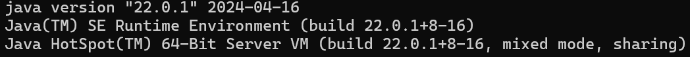
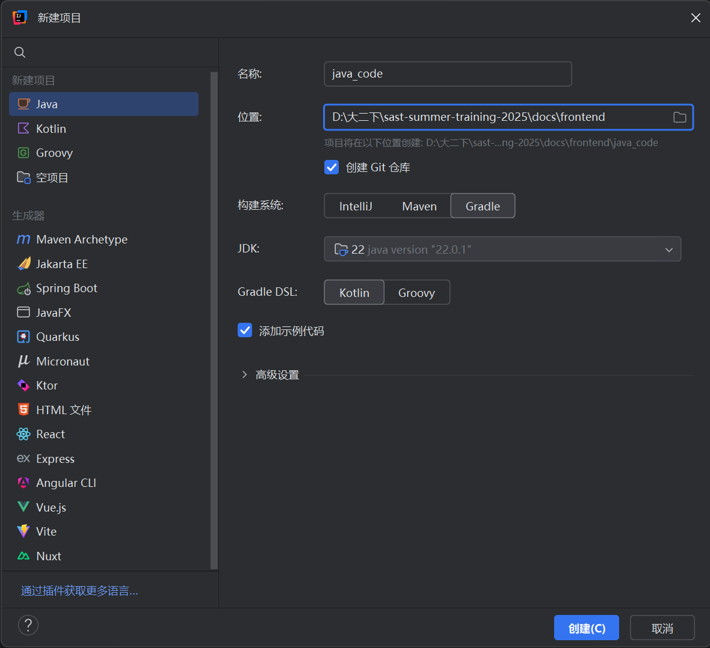

### 一、安装 JDK

在运行 Java 程序前，需先安装 Java 开发工具包（JDK）。本教程使用 **JDK 21**（最新的LTS长期支持版本）。

#### Windows / macOS 用户

推荐从 Oracle 官网下载对应平台的 JDK 21：[Oracle Java Downloads](https://www.oracle.com/java/technologies/javase/jdk21-archive-downloads.html)

#### Linux 用户（以 Ubuntu 为例）

可以使用如下命令：

```bash
sudo add-apt-repository ppa:linuxuprising/java
sudo apt update
sudo apt install oracle-java21-installer --install-recommends
```

使用`java -version`命令检验是否安装成功，下图为参考输出（具体版本以实际安装为准）：



### 二、命令行编译与运行 Java 程序

```
javac YourProgram.java   # 编译
java YourProgram         # 运行
java YourProgram.java    # 编译 + 运行（部分环境支持）
```

### 三、推荐开发工具：IntelliJ IDEA

建议使用 JetBrains 的 IntelliJ IDEA 作为开发环境，功能强大，适合 Java 开发。

#### 获取Free educational licenses

进入以下网址并填写信息：https://www.jetbrains.com/shop/eform/students

[**注意**邮件地址后缀和我们平时用的不同，是@mails.**thu**.edu.cn]

如果邮件填写正确，你会收到一封验证邮件。点击邮件中的链接并一路前进，会到达注册/登录页面。这时，你已经用你的清华邮箱证明了你的学生身份，因此注册时可以用任意邮箱，并且不需要上面提到的特殊后缀。注册时使用的邮箱用于后续登录账戶。登录完成后，点击 License 或进入https://account.jetbrains.com/licenses，你会看到你拥有了这些全家桶产品一年的使用权。

#### 安装 IDE 

进入https://www.jetbrains.com/toolbox-app并下载安装 Toolbox（当然，也可以直接点击 License 页面中的对应链接单独下载 IntelliJ IDEA）。大家也可以下载里面的其他软件体验。

### IntelliJ IDEA使用简介

点击左上角“文件->新建”新建一个项目，选择用Gradle来进行构建，可以参考下图：



最后，请将https://github.com/kjcKen/sast_2025_java的仓库fork一份，然后将fork的仓库clone到本地（~~相信大家都会用git了吧~~）祝大家收获一段愉快的java学习之旅！

